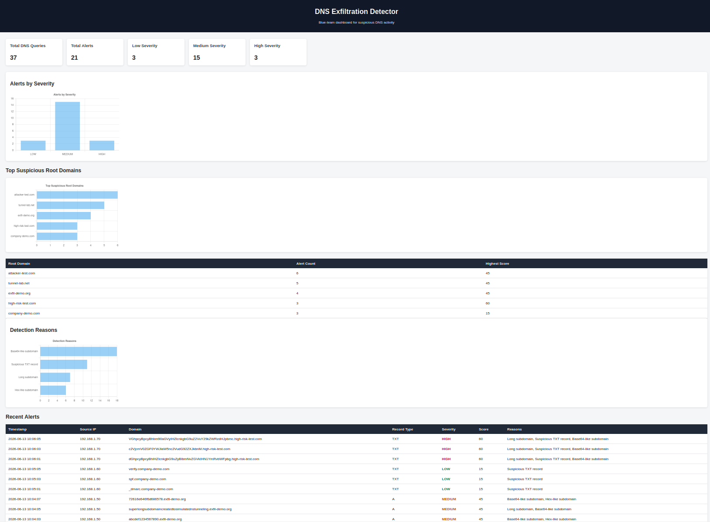
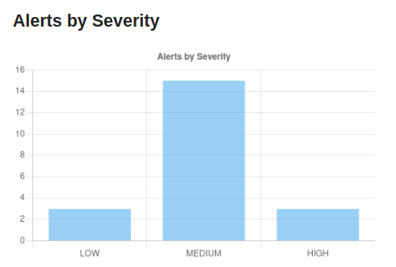
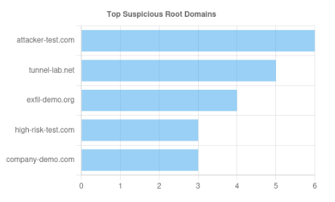
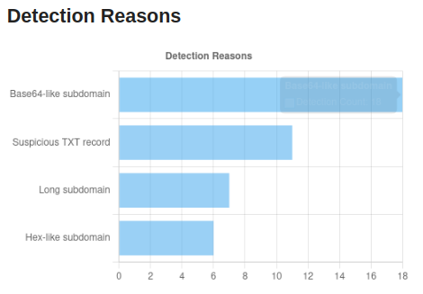

# DNS Exfiltration Detector

A defensive cybersecurity portfolio project that analyzes DNS logs for signs of DNS tunneling and DNS-based data exfiltration.

The project started as an offline command-line DNS log analyzer and has expanded into a Flask-powered dashboard that stores DNS queries and alerts in SQLite, then visualizes suspicious DNS activity with Chart.js.

## Project Overview

DNS Exfiltration Detector is designed as a blue-team/SOC-style tool that follows this workflow:

```text
DNS log file
→ Python analyzer
→ Detection rules
→ Alert scoring
→ SQLite storage
→ Flask dashboard
→ HTML/CSS/JavaScript visualizations
```

The goal is to demonstrate practical skills in:

- DNS log analysis
- Detection engineering
- Alert scoring
- SQLite database storage
- Flask backend development
- HTML/CSS dashboard design
- JavaScript and Chart.js visualization
- Defensive cybersecurity tooling

## Current Version

**v0.4 - Flask Dashboard with Chart.js Visualizations**

Current features:

- Reads DNS logs from a sample log file
- Parses timestamp, source IP, domain, and DNS record type
- Detects suspicious DNS indicators
- Assigns alert scores
- Converts scores into severity levels
- Skips blank lines
- Skips malformed log lines
- Prints CLI alert summaries
- Stores parsed DNS queries in SQLite
- Stores generated alerts in SQLite
- Displays dashboard summary cards with Flask
- Shows recent alerts in an HTML table
- Shows top suspicious root domains
- Uses CSS for dashboard styling
- Uses Chart.js to show alerts by severity
- Uses Chart.js to show top suspicious root domains
- Uses Chart.js to show detection reason counts

## Dashboard Preview

### Main Dashboard

Add a screenshot here after running the Flask dashboard.

## Dashboard Preview

### Main Dashboard



### Alert Severity Chart



### Top Suspicious Root Domains



### Detection Reasons



Recommended screenshot folder:

```text
screenshots/
├── dashboard-overview.png
├── alert-severity-chart.png
├── top-root-domains.png
└── detection-reasons.png
```

## Detection Rules

The analyzer currently detects:

- Long subdomains
- Suspicious TXT record queries
- Base64-like encoded subdomains
- Hex-like encoded subdomains

These indicators are commonly associated with DNS tunneling or DNS-based exfiltration attempts.

## Detection Scoring

The analyzer uses a simple scoring system.

| Detection Rule | Score |
|---|---:|
| Long subdomain | +20 |
| Suspicious TXT record | +15 |
| Base64-like subdomain | +25 |
| Hex-like subdomain | +20 |

Severity levels:

| Score | Severity |
|---:|---|
| 1-29 | LOW |
| 30-59 | MEDIUM |
| 60+ | HIGH |

Example:

```text
TXT record + Base64-like subdomain = 15 + 25 = 40
Severity: MEDIUM
```

Another example:

```text
Long subdomain + TXT record + Base64-like subdomain = 20 + 15 + 25 = 60
Severity: HIGH
```

## Why DNS Exfiltration Matters

DNS is normally used to resolve domain names into IP addresses.

For example, when a user visits a website, the computer may ask a DNS resolver for the IP address of that domain.

Attackers can abuse DNS by hiding encoded data inside subdomains and sending DNS queries to domains they control.

Example suspicious DNS query:

```text
dGhpcyBpcyBleGZpbA.attacker-test.com
```

The first part of the domain may contain encoded or random-looking data.

A defensive tool can look for suspicious patterns such as:

- Very long subdomains
- Encoded-looking strings
- Repeated unique subdomains
- Suspicious TXT record usage
- High DNS query volume
- Abnormal DNS query frequency

This project focuses on detecting those suspicious patterns from DNS logs.

## Technologies Used

Current version:

- Python
- Regular expressions
- SQLite
- Flask
- HTML
- CSS
- JavaScript
- Chart.js
- Linux command line
- Git/GitHub

## Project Structure

```text
dns-exfiltration-detector/
├── analyzer.py
├── app.py
├── database.py
├── README.md
├── data/
│   └── sample_dns.log
├── docs/
│   └── roadmap.md
├── static/
│   ├── css/
│   │   └── style.css
│   └── js/
│       └── charts.js
├── templates/
│   └── index.html
└── screenshots/
    └── README screenshots can be added here
```

## File Descriptions

| File | Purpose |
|---|---|
| `analyzer.py` | Reads DNS logs, applies detection rules, scores alerts, and saves results |
| `database.py` | Creates SQLite tables and provides database helper functions |
| `app.py` | Flask web application and dashboard route |
| `data/sample_dns.log` | Sample benign and suspicious DNS log entries |
| `templates/index.html` | Main dashboard HTML page |
| `static/css/style.css` | Dashboard styling |
| `static/js/charts.js` | Chart.js visualization logic |
| `docs/roadmap.md` | Version roadmap and planned improvements |

## Sample DNS Log Format

Each log line uses this format:

```text
timestamp,source_ip,domain,record_type
```

Example:

```text
2026-06-13 10:01:10,192.168.1.25,dGhpcyBpcyBleGZpbA.attacker-test.com,TXT
```

The analyzer parses each line into:

- Timestamp
- Source IP
- Domain
- DNS record type

## Example CLI Output

```text
DNS Exfiltration Detector
-------------------------
Scanning DNS logs for suspicious activity...

[MEDIUM] dGhpcyBpcyBleGZpbA.attacker-test.com
  Timestamp: 2026-06-13 10:01:10
  Source IP: 192.168.1.25
  Record Type: TXT
  Score: 40
  Reasons: Suspicious TXT record, Base64-like subdomain

[HIGH] dGhpcyBpcyBhIHZlcnkgbG9uZyBlbmNvZGVkIHN1YmRvbWFpbg.high-risk-test.com
  Timestamp: 2026-06-13 10:06:01
  Source IP: 192.168.1.70
  Record Type: TXT
  Score: 60
  Reasons: Long subdomain, Suspicious TXT record, Base64-like subdomain

Summary
-------
Total queries analyzed: 37
Total alerts generated: 21
```

Your exact totals may differ depending on the current sample log file and whether the SQLite database was reset before running the analyzer.

## How to Run

### 1. Clone the repository

```bash
git clone https://github.com/adelcampovj/dns-exfiltration-detector.git
cd dns-exfiltration-detector
```

### 2. Create a virtual environment

```bash
python3 -m venv venv
```

### 3. Activate the virtual environment

```bash
source venv/bin/activate
```

### 4. Install Flask

```bash
pip install flask
```

### 5. Run the offline analyzer

```bash
python analyzer.py
```

This will:

- Read `data/sample_dns.log`
- Analyze DNS events
- Generate scored alerts
- Create `data/dns_events.db`
- Save DNS queries and alerts to SQLite

### 6. Run the Flask dashboard

```bash
python app.py
```

Then open:

```text
http://127.0.0.1:5000
```

## Important Note About the Database

The SQLite database file is generated locally when the analyzer runs:

```text
data/dns_events.db
```

This file is ignored by Git using `.gitignore`.

If you want to reset the database and reload the sample data:

```bash
rm data/dns_events.db
python analyzer.py
python app.py
```

## Dashboard Features

The Flask dashboard currently displays:

- Total DNS queries
- Total alerts
- Low severity alert count
- Medium severity alert count
- High severity alert count
- Alerts by severity chart
- Top suspicious root domains chart
- Top suspicious root domains table
- Detection reasons chart
- Recent alerts table

## Legal and Ethical Use

This project is for defensive cybersecurity learning and portfolio development only.

It should only be used with:

- Sample logs
- Generated test data
- DNS logs from systems or networks you own or have permission to analyze

This project does not perform attacks, does not exfiltrate data, and does not generate malicious DNS traffic.

## Version Roadmap

| Version | Focus | Status |
|---|---|---|
| v0.1 | Offline DNS log analyzer | Complete |
| v0.2 | SQLite database storage | Complete |
| v0.3 | Flask dashboard | Complete |
| v0.4 | Chart.js visualizations | Complete |
| v0.5 | Near real-time monitoring | Planned |

## Planned Improvements

Future improvements may include:

- DNS query volume detection
- Repeated unique subdomain detection
- Abnormal DNS query frequency detection
- Better root domain parsing
- Alert filtering by severity
- Separate alerts page
- Separate domains page
- CSV export for alerts
- Near real-time log monitoring
- Optional support for additional DNS log formats

## Portfolio Value

This project demonstrates practical blue-team skills by combining cybersecurity detection logic with backend development, database storage, frontend design, and data visualization.

Relevant skills shown:

- Python security scripting
- DNS analysis
- Detection engineering
- SQLite database design
- Flask web development
- Frontend dashboard development
- Chart.js data visualization
- Git/GitHub version control
- Defensive cybersecurity project design